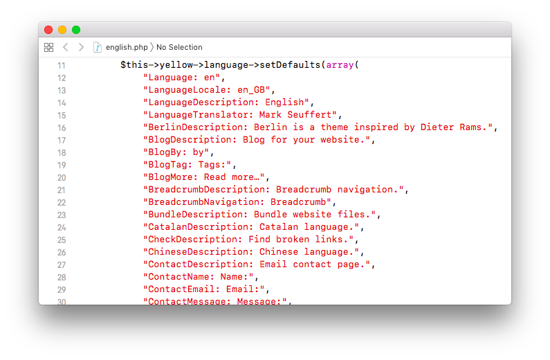

<a href="README-de.md">Deutsch</a> &nbsp; <a href="README.md">English</a> &nbsp; <a href="README-sv.md">Svenska</a>

# Language 0.9.4

Translations for your website.

## How to install an extension

[Download ZIP file](https://github.com/annaesvensson/yellow-language/raw/main/downloads/english.zip) and copy it into your `system/extensions` folder. [Learn more about extensions](https://github.com/annaesvensson/yellow-update).

## How to make a translation

When you install a website you are greeted with a hello. You can [translate the English language file](https://github.com/annaesvensson/yellow-language/blob/main/translations/english/english.php) if a language is missing. This will show you which text lines and text fragments are available. A maintainer takes care of everything else. Did you make a new translation? Fork this repository. Upload your changes and create a pull request for the repository `annaesvensson/yellow-language`.

Alternatively you can [create an issue](https://github.com/annaesvensson/yellow-language/issues) and copy/paste the language file.

## How to improve a translation

You can improve a translation if something is wrong or missing. The installed languages are stored in your `system/workers` folder. Sometimes they contain text lines in English, which have not been translated. That's why it's good to check from time to time that everything looks okay. Did you improve a translation? Fork this repository. Upload your changes and create a pull request for the repository `annaesvensson/yellow-language`.

## Acknowledgements

This extension includes translations by various contributors. Thank you for the good work.

## Developer

Anna Svensson. [Get help](https://datenstrom.se/yellow/help/).
