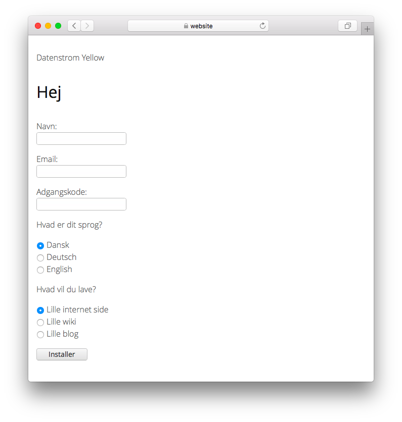

# Danish 0.9.5

Dansk sprog. Oversat af David Garcia.

## Hvordan man installerer en udvidelse

[Download ZIP-fil](https://github.com/annaesvensson/yellow-language/raw/main/downloads/danish.zip) og kopier den til din `system/extensions`-mappe. [Få mere at vide om udvidelser](https://github.com/annaesvensson/yellow-update).

## Hvordan man tilpasser et sprog

Alle sprogindstillinger er gemt i filen `system/extensions/yellow-language.ini`. Du kan ændre denne fil som du vil og også tilføje dine egne sprogindstillinger, for eksempel billedtekster. Dine ændringer vil ikke blive overskrevet, når hjemmesiden er opdateret.

Standardsproget er defineret i filen `system/extensions/yellow-system.ini`. Et andet sprog kan defineres i [sideindstillinger](https://github.com/annaesvensson/yellow-core#settings-page) øverst på hver side, for eksempel `Language: da`. [Få mere at vide om sprog](https://datenstrom.se/yellow/help/how-to-customise-languages).

Har du spørgsmål? [Få hjælp](https://datenstrom.se/yellow/help/).
