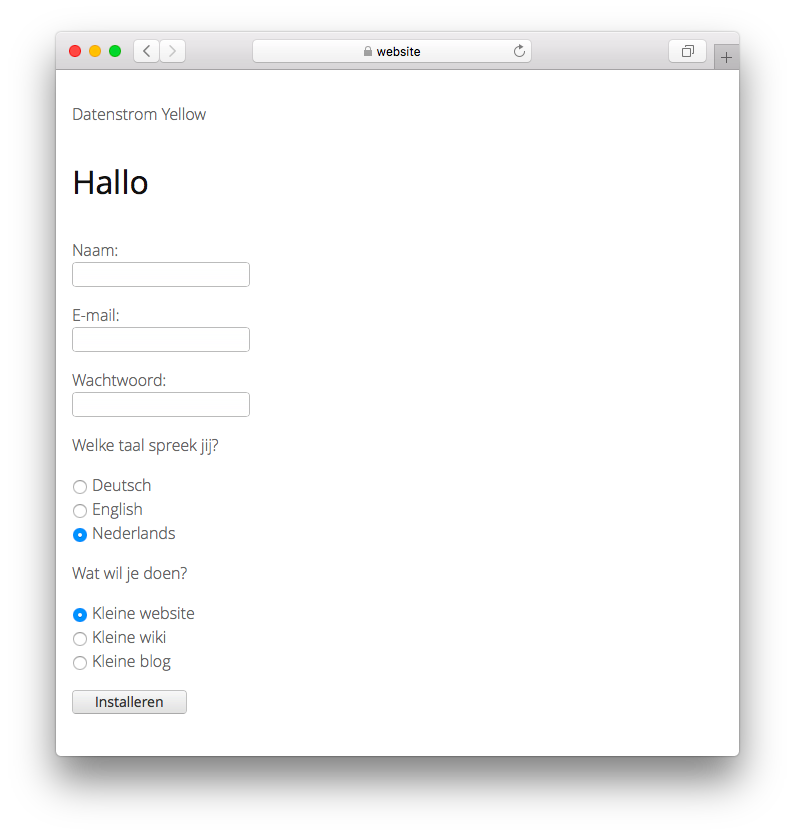

# Dutch 0.8.44

Nederlandse taal.

## Hoe een extensie te installeren

[Download het ZIP-bestand](https://github.com/annaesvensson/yellow-language/raw/main/downloads/dutch.zip) en kopieer het naar de map `system/extensions`. [Meer informatie over extensies](https://github.com/annaesvensson/yellow-update).

## Hoe een taal aan te passen

Alle taalinstellingen worden opgeslagen in het bestand `system/extensions/yellow-language.ini`. U kunt deze instellingen bewerken en ook uw eigen taalinstellingen toevoegen, bijvoorbeeld bijschriften bij afbeeldingen. Uw wijzigingen worden niet overschreven wanneer de website wordt bijgewerkt.

De standaardtaal is gedefinieerd in het bestand `system/extensions/yellow-system.ini`. Een andere taal kan worden gedefinieerd in de [pagina-instellingen](https://github.com/annaesvensson/yellow-core#settings-page) bovenaan elke pagina, bijvoorbeeld `Language: nl`. [Meer informatie over talen](https://datenstrom.se/yellow/help/how-to-customise-a-language).

## Vertaler

Robin Vannieuwenhuijse. [Krijg hulp](https://datenstrom.se/yellow/help/).
