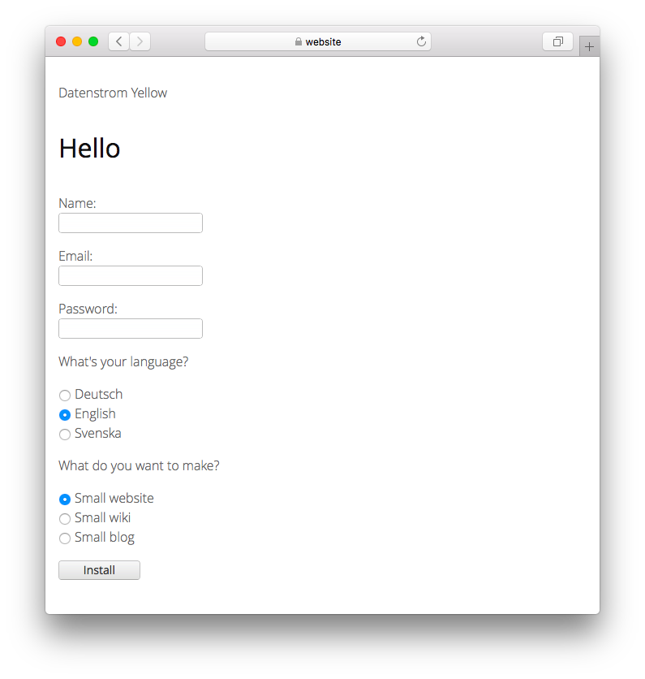

# English 0.8.44

English language.

## How to install an extension

[Download ZIP file](https://github.com/annaesvensson/yellow-language/raw/main/downloads/english.zip) and copy it into your `system/extensions` folder. [Learn more about extensions](https://github.com/annaesvensson/yellow-update).

## How to customise a language

All language settings are stored in file `system/extensions/yellow-language.ini`. You can edit these settings and also add your own language settings, for example image captions. Your changes will not be overwritten when the website is updated.

The default language is defined in file `system/extensions/yellow-system.ini`. A different language can be defined in the [page settings](https://github.com/annaesvensson/yellow-core#settings-page) at the top of each page, for example `Language: en`. [Learn more about languages](https://datenstrom.se/yellow/help/how-to-customise-a-language).

## Translator

Mark Seuffert. [Get help](https://datenstrom.se/yellow/help/).
