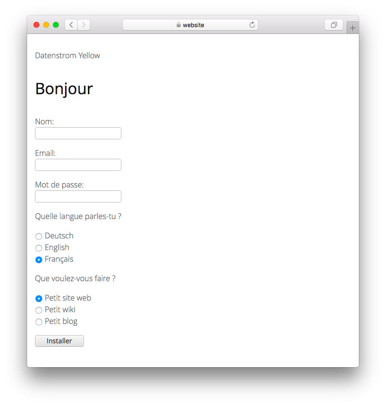

# French 0.9.1

Langue française.

## Comment installer une extension

[Téléchargez le fichier ZIP](https://github.com/annaesvensson/yellow-language/raw/main/downloads/french.zip) et copiez-le dans votre dossier `system/extensions`. [En savoir plus sur les extensions](https://github.com/annaesvensson/yellow-update).

## Comment personnaliser une langue

Tous les paramètres de langues sont stockés dans le fichier `system/extensions/yellow-language.ini`. Vous pouvez modifier ces paramètres et également ajouter vos propres paramètres de langue, par exemple des légendes d'image. Vos modifications ne seront pas écrasées lors de la mise à jour du site web.

La langue par défaut est définie dans le fichier `system/extensions/yellow-system.ini`. Une langue différente peut être définie dans les [paramètres de la page](https://github.com/annaesvensson/yellow-core#settings-page) en haut de chaque page, par exemple `Langue: fr`. [En savoir plus sur les langues](https://datenstrom.se/yellow/help/how-to-customise-a-language).

## Traducteur

Juh Nibreh. [Obtenir de l'aide](https://datenstrom.se/yellow/help/).
