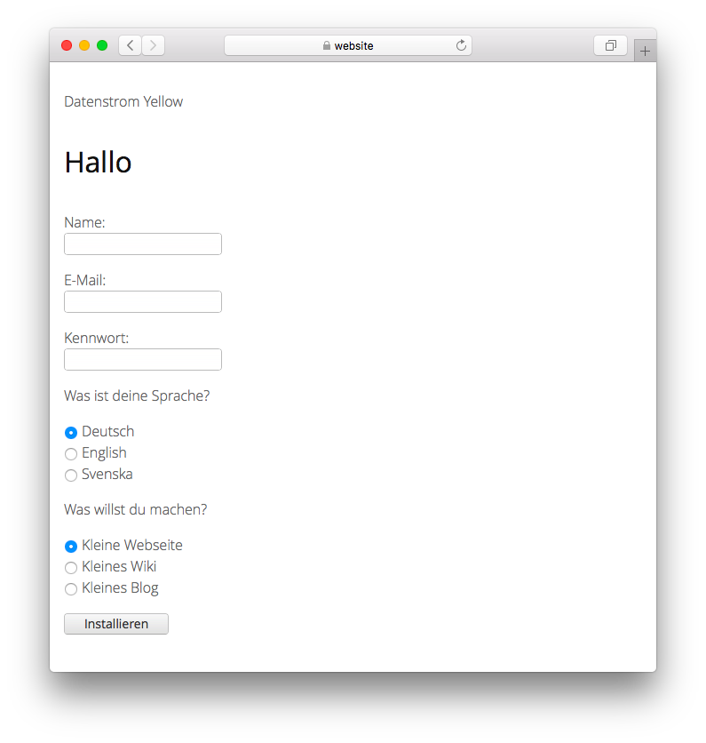

# German 0.9.3

Deutsche Sprache.

## Wie man eine Erweiterung installiert

[ZIP-Datei herunterladen](https://github.com/annaesvensson/yellow-language/raw/main/downloads/german.zip) und in dein `system/extensions`-Verzeichnis kopieren. [Weitere Informationen zu Erweiterungen](https://github.com/annaesvensson/yellow-update/tree/main/README-de.md).

## Wie man eine Sprache anpasst

Alle Spracheinstellungen sind in der Datei `system/extensions/yellow-language.ini` gespeichert. Du kannst diese Einstellungen bearbeiten und auch deine eigenen Spracheinstellungen hinzufügen, beispielsweise Bildunterschriften. Deine Änderungen werden bei der Aktualisierung der Webseite nicht überschrieben.

Die Standardsprache wird in der Datei `system/extensions/yellow-system.ini` festgelegt. Eine andere Sprache lässt sich in den [Seiteneinstellungen](https://github.com/annaesvensson/yellow-core/tree/main/README-de.md#einstellungen-seite) ganz oben auf jeder Seite festlegen, zum Beispiel `Language: de`. [Weitere Informationen zu Sprachen](https://datenstrom.se/de/yellow/help/how-to-customise-a-language).

## Übersetzer

David Fehrmann. [Hilfe finden](https://datenstrom.se/de/yellow/help/).
