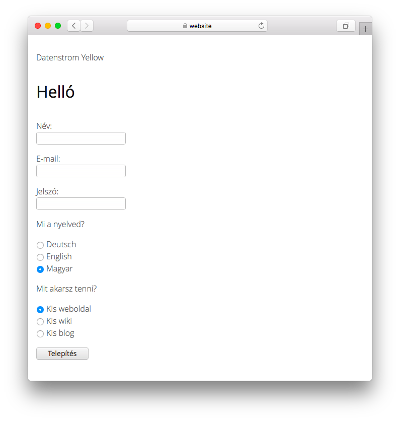

# Hungarian 0.9.2

Magyar nyelv.

## Hogyan kell telepíteni egy bővítményt

[Töltse le a ZIP-fájlt](https://github.com/annaesvensson/yellow-language/raw/main/downloads/hungarian.zip), és másolja be a `system/extensions` mappájába. [További információ a bővítményekről](https://github.com/annaesvensson/yellow-update).

## Hogyan szabhatunk testre egy nyelvet

Az összes nyelvi beállítás a `system/extensions/yellow-language.ini` fájlban tárolódik. Módosíthatja ezeket a beállításokat, és hozzáadhatja saját nyelvi beállításait is, például képaláírásokat. A módosítások nem íródnak felül a webhely frissítésekor.

Az alapértelmezett nyelvet a `system/extensions/yellow-system.ini` fájl határozza meg. Az egyes oldalak tetején található [oldalbeállítások](https://github.com/annaesvensson/yellow-core#settings-page) között más nyelv definiálható, például `Language: hu`. [További információ a nyelvekről](https://datenstrom.se/yellow/help/how-to-customise-a-language).

## Fordító

Ádám Tuba. [Kaphat segítséget](https://datenstrom.se/yellow/help/).
