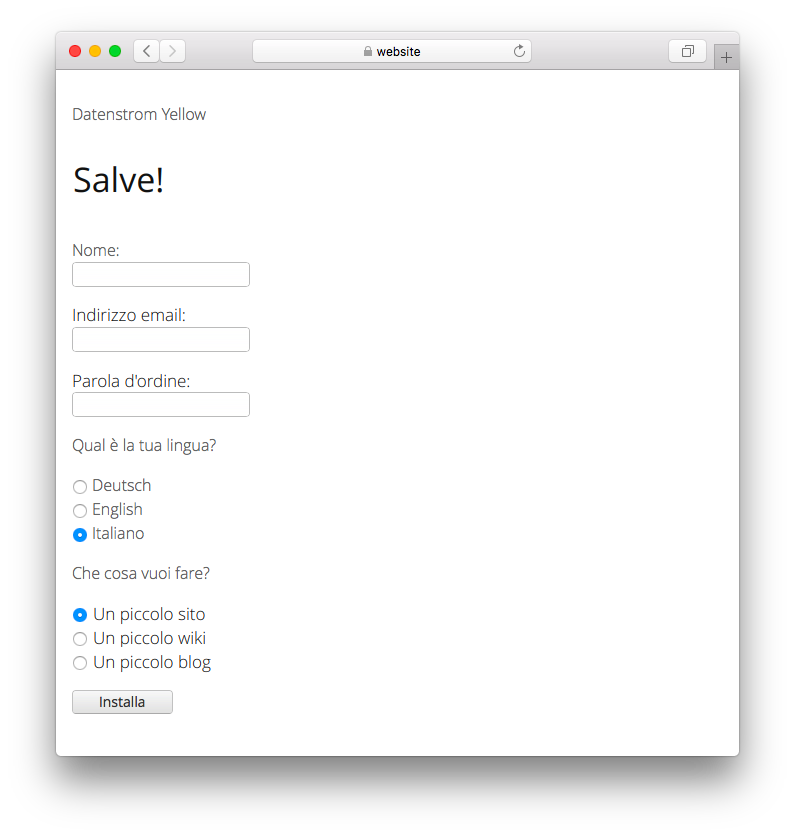

# Italian 0.9.1

Lingua italiano.

## Come installare le estensioni

[Scarica il file ZIP](https://github.com/annaesvensson/yellow-language/raw/main/downloads/italian.zip) e copialo nella cartella `system/extensions`. [Ulteriori informazioni sulle estensioni](https://github.com/annaesvensson/yellow-update).

## Come personalizzare una lingua

Tutte le impostazioni delle lingue sono memorizzate nel file `system/extensions/yellow-language.ini`. Puoi modificare queste impostazioni e anche aggiungere le tue impostazioni di lingua, ad esempio le didascalie delle immagini. Le tue modifiche non verranno sovrascritte quando il sito web verrà aggiornato.

La lingua predefinita è definita nel file `system/extensions/yellow-system.ini`. È possibile definire una lingua diversa nelle [impostazioni della pagina](https://github.com/annaesvensson/yellow-core#settings-page) nella parte superiore di ogni pagina, ad esempio `Language: it`. [Ulteriori informazioni sulle lingue](https://datenstrom.se/yellow/help/how-to-customise-a-language).

## Traduttore

Giovanni Salmeri. [Chiedi aiuto](https://datenstrom.se/yellow/help/).
