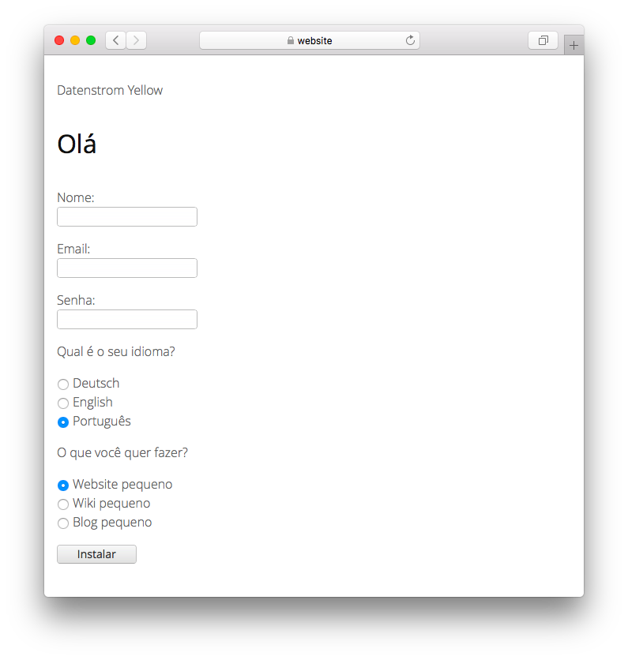

# Portuguese 0.9.5

Idioma portugues.

## Como instalar uma extensão

[Baixe o arquivo ZIP](https://github.com/annaesvensson/yellow-language/raw/main/downloads/portuguese.zip) e copie-o para a pasta `system/extensions`. [Saiba mais sobre extensões](https://github.com/annaesvensson/yellow-update).

## Como personalizar um idioma

Todas as configurações de idiomas são armazenadas no arquivo `system/extensions/yellow-language.ini`. Pode alterar este ficheiro como quiser e também adicionar suas próprias configurações de idioma, por exemplo, legendas de imagens. Suas alterações não serão substituídas quando o site for atualizado.

O idioma padrão é definido no arquivo `system/extensions/yellow-system.ini`. Um idioma diferente pode ser definido nas [configurações da página](https://github.com/annaesvensson/yellow-core#settings-page) na parte superior de cada página, por exemplo `Language: pt`. [Saiba mais sobre idiomas](https://datenstrom.se/yellow/help/how-to-customise-languages).

## Tradutor

Al Garcia, Quen-Quen Potter. [Obter ajuda](https://datenstrom.se/yellow/help/).
