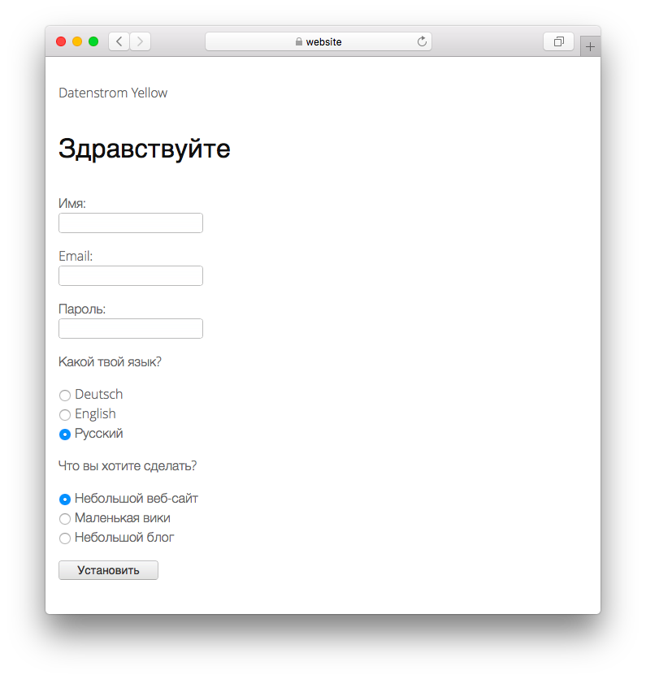

# Russian 1.0.1

Русский язык. Разработано Anna Svensson.

## Как установить расширение

[Загрузите ZIP-файл](https://github.com/annaesvensson/yellow-language/raw/main/downloads/russian.zip) и скопируйте его в папку `system/extensions`. [Подробнее о расширениях](https://github.com/annaesvensson/yellow-update).

## Как настроить язык

Все языковые настройки хранятся в файле `system/extensions/yellow-language.ini`. Вы можете изменить этот файл по своему усмотрению, а также добавить собственные языковые настройки, например подписи к изображениям. Ваши изменения не будут перезаписаны при обновлении сайта.

Язык по умолчанию определяется в файле `system/extensions/yellow-system.ini`. Другой язык можно определить в [настройках страницы](https://github.com/annaesvensson/yellow-core#settings-page) в верхней части каждой страницы, например `Language: ru`. [Подробнее о языках](https://datenstrom.se/yellow/help/how-to-customise-languages).

## Благодарности

В этом расширении использованы материалы от Сергей Ворон. Спасибо за работу, всё было не так уж плохо.

Есть вопросы? [Получить помощь](https://datenstrom.se/yellow/help/).
