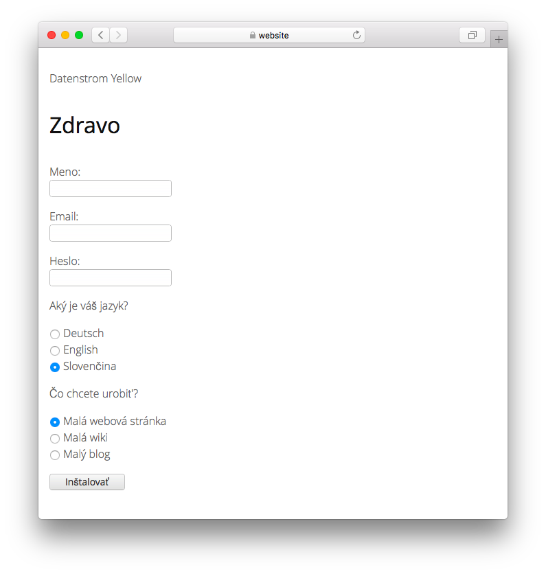

# Slovak 0.9.3

Slovenský jazyk.

## Ako nainštalovať rozšírenie

[Stiahnite si súbor ZIP](https://github.com/annaesvensson/yellow-language/raw/main/downloads/slovak.zip) a skopírujte ho do priečinka `system/extensions`. [Ďalšie informácie o rozšíreniach](https://github.com/annaesvensson/yellow-update).

## Ako prispôsobiť jazyk

Všetky nastavenia jazykov sú uložené v súbore `system/extensions/yellow-language.ini`. Tieto nastavenia môžete upraviť a tiež pridať svoje vlastné jazykové nastavenia, napríklad popisky obrázkov. Vaše zmeny sa pri aktualizácii webovej stránky neprepíšu.

Predvolený jazyk je definovaný v súbore `system/extensions/yellow-system.ini`. Iný jazyk možno definovať v [nastaveniach stránky](https://github.com/annaesvensson/yellow-core#settings-page) v hornej časti každej stránky, napríklad `Language: sk`. [Ďalšie informácie o jazykoch](https://datenstrom.se/yellow/help/how-to-customise-languages).

## Prekladateľ

Ádám Tuba. [Získajte pomoc](https://datenstrom.se/yellow/help/).
